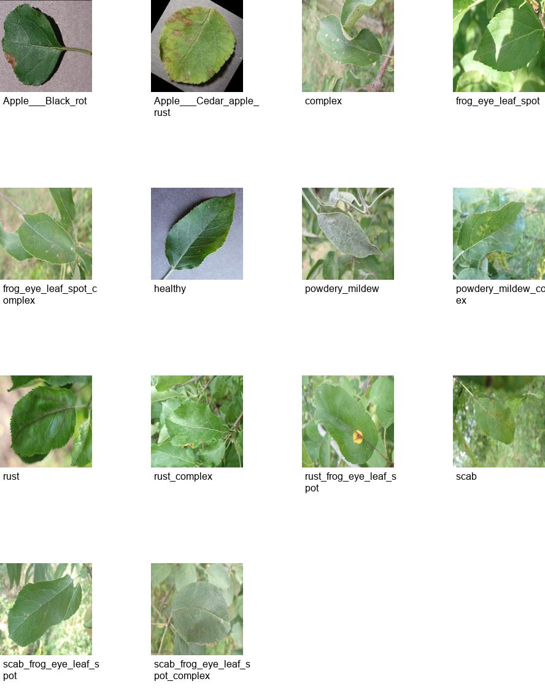

# 🍏 Apple Leaf Disease Prediction using CNN

This project uses a Convolutional Neural Network (CNN) built with TensorFlow/Keras to classify apple leaf diseases. It helps identify healthy and infected apple leaves using image data. A Streamlit web app is provided to make predictions through a user-friendly interface.

## 🧠 Project Overview

- **Goal**: Detect diseases in apple leaves from images.
- **Model**: Convolutional Neural Network (CNN)
- **Frameworks**: TensorFlow, Keras, Streamlit
- **Accuracy**: ~88% on test set

---

## 📂 Dataset

- **Source**: [Kaggle - Plant Pathology 2021 FGVC8](https://www.kaggle.com/c/plant-pathology-2021-fgvc8/data?select=train.csv)
- **Classes**:
  - Apple Scab
  - Black Rot
  - Cedar Apple Rust
  - Healthy

You’ll need to download the dataset from Kaggle and extract the contents.

### 🖼️ Sample Image



---

## 📦 Requirements

Install the dependencies with:

```bash
pip install -r requirements.txt
```

**`requirements.txt`:**
```text
tensorflow==2.10.0
numpy
pandas
matplotlib
scikit-learn
opencv-python
streamlit
```

---

## 🏗️ Project Structure

```
apple-leaf-disease-prediction/
├── dataset/
│   └── train/ (images)
│   └── train.csv
├── sample_leaf.jpg
├── app.py
├── train_model.py
├── requirements.txt
└── README.md
```

---

## ⚙️ Training the Model

To train the model from scratch, run:

```bash
python train_model.py
```

This script will:
- Load and preprocess images and labels
- Train a CNN model
- Save the model as `apple_leaf_model.h5`

You can then use this file for inference in the Streamlit web app.

---

## 🌐 Streamlit Web App

To launch the web application:

```bash
streamlit run app.py
```

Upload an apple leaf image, and the model will classify it into one of the disease categories.

---

## 📸 Example Prediction

The model will return one of the following based on the uploaded leaf image:

- ✅ Healthy
- ⚠️ Apple Scab
- ⚠️ Black Rot
- ⚠️ Cedar Apple Rust

---

## 🚀 Future Improvements

- Integrate mobile deployment using TensorFlow Lite
- Real-time prediction from mobile camera feed
- Add more data augmentation to improve generalization

---

## 🙌 Acknowledgements

- Kaggle for providing the dataset
- TensorFlow/Keras for deep learning tools
- Streamlit for the web app framework

---

## 📃 License

This project is open-source under the MIT License.
